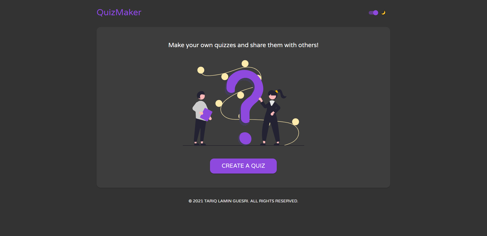
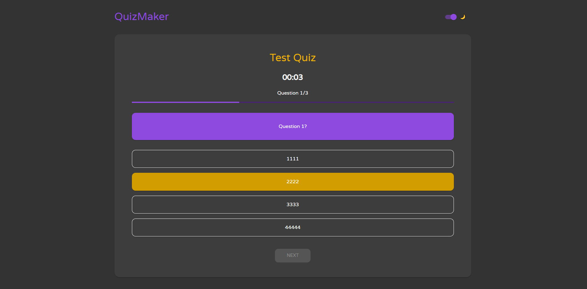

# QuizMaker

## Description

QuizMaker is a MERN stack application that lets you create quizzes and share them with others.

## Technologies used

TypeScript - React - Redux - Express - MongoDB - MUI - Jest

<div></div>

<div></div>

**Live preview:** [QuizMaker](https://quiz-maker.tariqguesri.com/)

## Installing dependencies

This repo uses [Yarn](https://yarnpkg.com/), it is required because I'm using [yarn workspaces](https://classic.yarnpkg.com/en/docs/workspaces/)

```sh
yarn
```

## Usage

Before you run the project, make sure to create a `.env` file in `backend/` (Or you can just copy the sample file in the config folder and rename it to config.env)

This is an example how the config file should look

```.env
NODE_ENV=development
PORT=5000
# NODE_PATH=./src ts-node ./src/server.ts

MONGODB_URI=YOUR_PRODUCTION_URL
MONGODB_URI_DEV=mongodb://localhost:27017/QuizMakerDev
MONGODB_URI_TEST=mongodb://localhost:27017/QuizMakerTest
```

The frontend config can be found on `frontend/src/config/index.ts`

To run the project in development mode, run:

```sh
yarn dev
```

In order to run it in production mode, run this: 

```sh
yarn start:build
```

Or you can start it without building it again (In case you made your produciton build already):

```sh
yarn start
```


## Linting and Code Quality

To lint all files run:

```sh
yarn lint:check
```

To apply possible fixes, run:

```sh
yarn lint:fix
```

## Tests and Test Coverage

The repo uses [Jest](https://jestjs.io/) for unit tests and code coverage on the backend and [React Testing Library/Jest](https://testing-library.com/) on the frontend (Which is provided by create-react-app).

To run tests once, run

```sh
yarn test
```

To run tests once with coverage, run

```sh
yarn test:cov
```

coverage data is stored in `./backend/coverage` and `./frontend/coverage` directories
